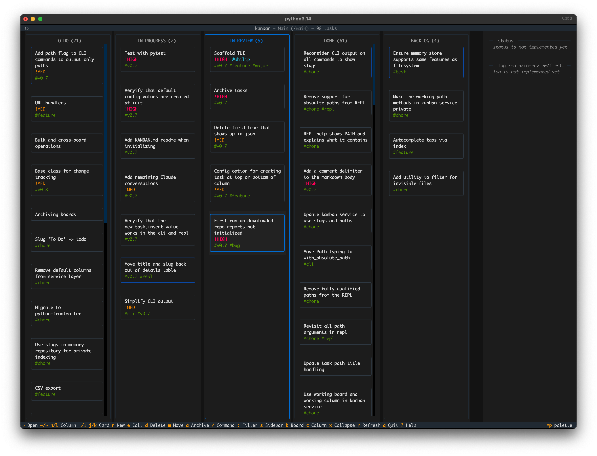
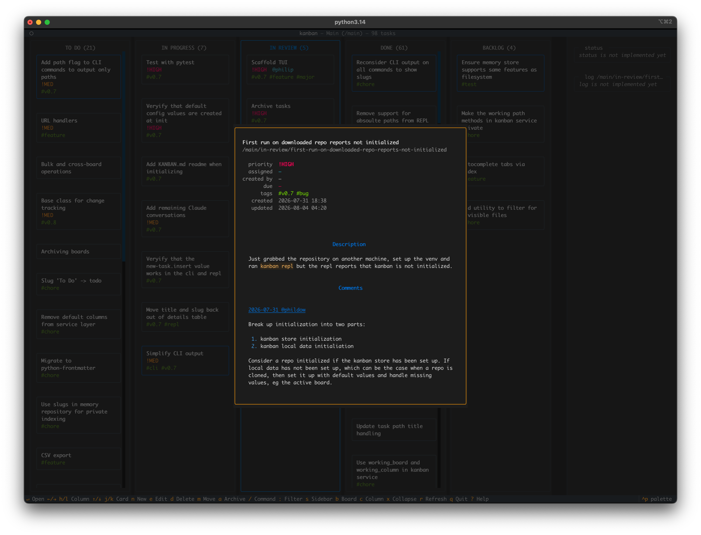
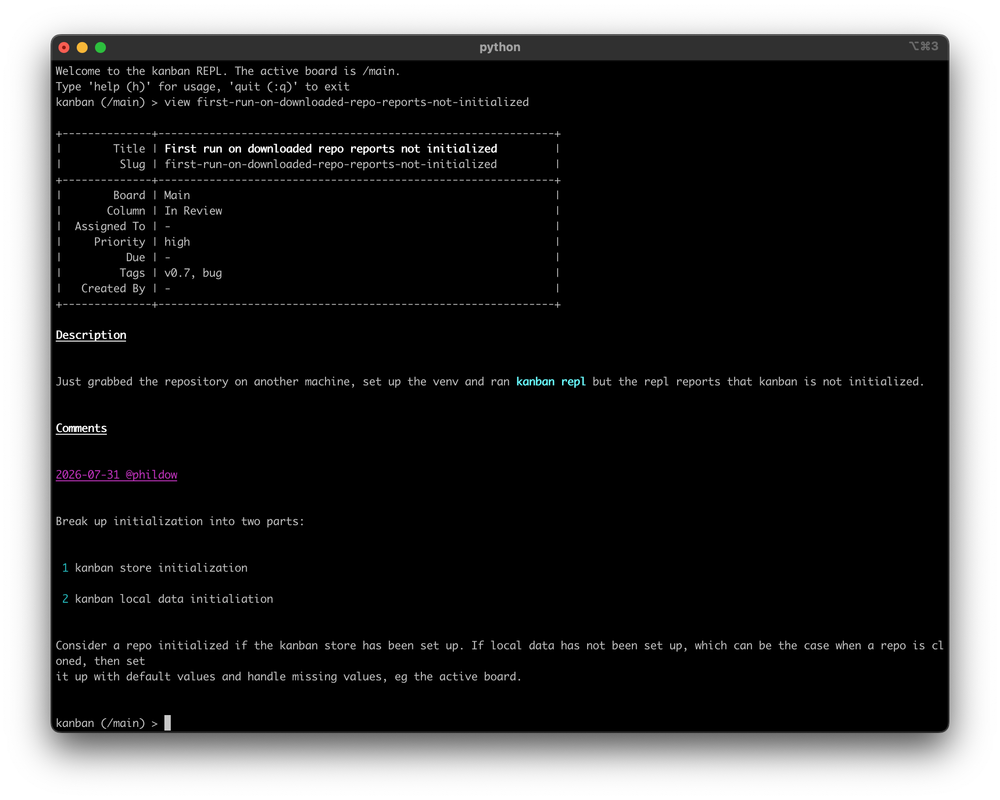
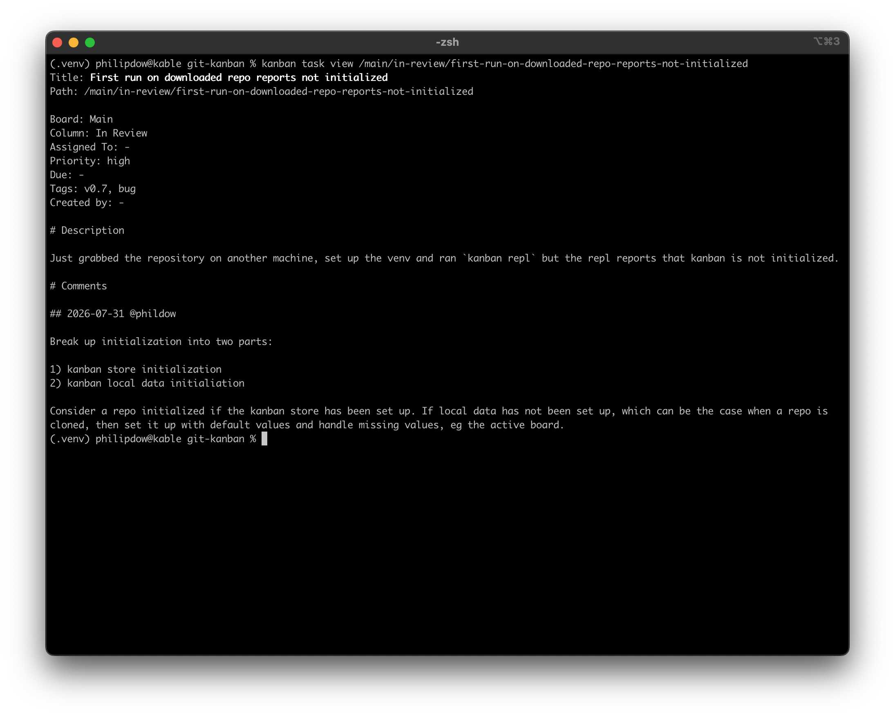

# Terminal Kanban

Kanban for engineers. Git-backed, Markdown-based kanban for your terminal.

Run it as a first class CLI, REPL, or TUI:

 &nbsp;  
 &nbsp;  

Requirements:

- Modern terminal emulator
- Python 3.13+

## Installation

Currently from source only. I recommend creating a virtual enviornment and installing into it. Requires `virtualenv`. From the root project directory run:

```
$ python -m venv .venv
$ pip install -e .
```

## Version Map

- 0.6 - CLI & REPL stable
- 0.7 - TUI stable
- 0.8 - Git change tracking & history
- 0.9 - Indexing & indexed search
- 1.0 - Release

## Motivation

After some initial success with coding agents at work I wanted to see how far I could get building an application from scratch. I settled on a kanban applicaton for the terminal with CLI, REPL, and TUI interfaces. Something small enough in scope to be approachable but large enough to be a challenge. I liked the idea of building a terminal application, and I love the idea of replacing Jira boards.

Agents do 90% or more of the coding. I switch between Copilot with Anthropic models and Claude Code.

 I occasionally hand code features or make changes across components to ensure I continue to understand the system. I hand-coded most of the initial typing with `mypy` for v0.6, which further clarirfied the use of the `Path` and `Slug` types and significantly improved the design of the services layer, CLI, and REPL.

 Typing is good.

## Dogfooding

I began dogfooding the project with v0.5. I moved most of the TODOs out of the README where I was tracking them and into a kanban board saved in this repository. That work is on the `kanban` branch, which per dicussions with Claude is set up as a git worktree. See CLAUDE.md for more information about git worktrees and how this project uses them.

**Try it yourself:**

Git integration isn't set up yet, so associate the .kanban-store directory with the kanban worktree:

```
$ git checkout kanban
$ git checkout main
$ git worktree add .kanban-store kanban
```

And run the TUI:

```
$ kanban tui
```

## Claude Dekstop Conversations

Before writing any code I had a number of discussions with Claude about the pros and cons of my initial design choices. The conversations led to architecture decisions, design patterns, and UI choices.
Much of the CLAUDE.md file is composed of Claude responses during these conversations and later iterated on. I return to and develop the conversations as I work on the project.

I've included these conversations to provide some insight into the upfront and ongoing design work invovled in this project along with insights into my decision making process and how I interact with Claude outside of actual coding.

## Lessons

I firmly believe that we should build tools that augment human intellgence rather than replace it. I want agents to write code for humans, not other agents, and I want to remain in the loop, making architectural decisions and also checking that I understand what is being produced.

I've learned a number of lessons from this project:

- Architecture and specification are more important with agentic coding, not less
- Agentic coding is addictive with slot machine like mechanics: sometimes excellent, sometimes a giant mess
- You'll know when you've underspecified, the quality is worse. Pause and return to design
- Take it one piece at a time, don't yolo an entire project
- I talk architecture and design with Claude before writing code, and I do this outside of Claude Code
- My loop is Design with Claude -> Claude Code | Copilot -> Refactor & Test -> Repeat
- Review the diffs and tests, write your own commits
- Refactor often, the battle against entropy is real
- Trust, but verify
- Garbage in garbage out
- Vibe sometimes, don't get carried away

## Installation & Running

Install git-kanban from source:

```
$ git clone git@github.com:phildow/git-kanban.git
$ cd git-kanban
$ python -m venv .venv
$ pip install -e .
```

Change into your project directory and run:

```
$ (.venv) $ kanban init --bootstrap
$ (.venv) $ kanban repl
```

## Changelog

### v0.7

- The TUI
- Configuration
- Default configuration
- Comment headings
- Task archiving 
- Delete flag
- Add KANBAN.md
- Migrate to pytest

## Tests

Run tests:

```bash
$ ./run.sh tests
```
Or:
```
$ python -m pytest -n auto
```

Run static typechecking:

```bash
$ ./run.sh typecheck
```
Or:
```
$ pip install -e ".[dev]"
$ python -m mypy
```
